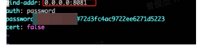

#### 云端vscode  
云端vscode的概念就是在浏览器中有和本地一样体验的vscode环境。在以下这个网站中，官方已经有实现在浏览器中的实现。

#### installation
https://github.com/coder/code-server/releases

```bash
## https://github.com/coder/code-server/releases
curl -fOL  sudo dpkg -i code-server_4.3.0_amd64.deb
sudo systemctl enable --now code-server@root
# Now visit http://127.0.0.1:8080. Your password is in ~/.config/code-server/config.yaml
```

```bash
vim ~/.config/code-server/config.yaml

```



启动

```bash
# 类似jupyter notebook
code-server

(base) [zengjunjie@gpu009 ~]$ 
(base) [zengjunjie@gpu009 ~]$ code-server
[2023-08-18T02:26:50.960Z] info  code-server 4.14.1 5c199629305a0b935b4388b7db549f77eae82b5a
[2023-08-18T02:26:50.961Z] info  Using user-data-dir ~/.local/share/code-server
[2023-08-18T02:26:50.975Z] info  Using config file ~/.config/code-server/config.yaml
[2023-08-18T02:26:50.975Z] info  HTTP server listening on http://0.0.0.0:8081/
[2023-08-18T02:26:50.975Z] info    - Authentication is enabled
[2023-08-18T02:26:50.975Z] info      - Using password from ~/.config/code-server/config.yaml
[2023-08-18T02:26:50.975Z] info    - Not serving HTTPS

```