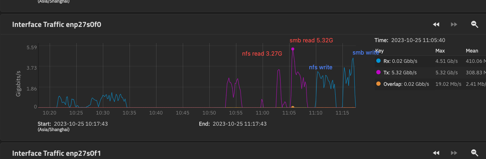

smb获胜

NAS上文件共享的协议通常有smb、nfs、webdav、ftp协议。这些文件管理协议，都包含了文件的列表、添加、删除、属性获取（文件大小、创建时间、修改时间等）等管理操作。
1. 协议简介
Samba  协议
服务信息块协议SMB（Service Message Block），支持范围广，安卓/win/mac/linux 都有原生支持，  挂载到系统上方便，几乎无感的访问文件。

NFS 协议
网络文件系统协议（Network File System），是TCP/IP协议集所提供的一种子协议，已经成为UNIX/LINUX类系统的标配。

WebDAV 协议
基于 HTTP1.1 协议的拓展升级版（Web-based Distributed Authoring and Versioning），可以很方便的跨越网关、防火墙。使得在公网上访问特别简单，并且通过https的公网访问拥有非常棒的安全性。

FTP 协议
文件传输协议（File Transfer Protocol）,  经典的文件共享协议。 为了补足FTP不安全的特性，又有FTPS（FTP over SSL）、SFTP（SSH文件传输协议）两种加密传输方式。 部分可参考http与https的关系。

2. 协议对比
内网：其中Samba 和 NFS 协议可以直接作为文件系统来用，通常用于局域网内的磁盘映射挂载。并且samba提供了很多的高级功能，使得可以在windows域里工作，跨系统以及win下使用samba更为便利。
公网：而WebDAV和FTPS通常用于公网上的文件管理， 又因为FTP（FTPS）需要开多个端口传输文件，存在通信的延迟、及理论上相对单一通道来说的安全性的问题，所以WebDAV协议更受欢迎些。（亦有把webdav、ftp挂载为文件系统的支持软件）

3. 协议速度
Samba 和 NFS 这两个速度是最快的，单纯的读写性能NFS更好些，如下。（此处有争议，理论上NFS快些，但实际上不同的环境得到的结果并不一致。）
而WebDav 和 FTP 相对上面两者来说慢的多，二者性能差不多。

 注：
通常情况下，nfs和smb使用时速度差不多，如果差别很大，请优化配置参数。 如果你在测试大量小文件（30k以下），并且系统没有任何调整优化时，可能会出现使用nfs的速度远低于webdav的速度的情况。导致这种情况的原因比较多，cpu、内存、分区格式、扇区大小都会有影响。

