### 1.下载安装vscode  
巨硬爸爸开源的全平台IED工匠，本身只是一个简单的文本编辑查看代码的工具，由于众多开发者贡献的免费插件，已经成为一个很有影响力的一个IDE开发工具，墙裂建议你们试试使用vscode进行远程开发，比pycharm的远程开发好用10000000倍。    
https://code.visualstudio.com/  
### 2.安装remote development插件
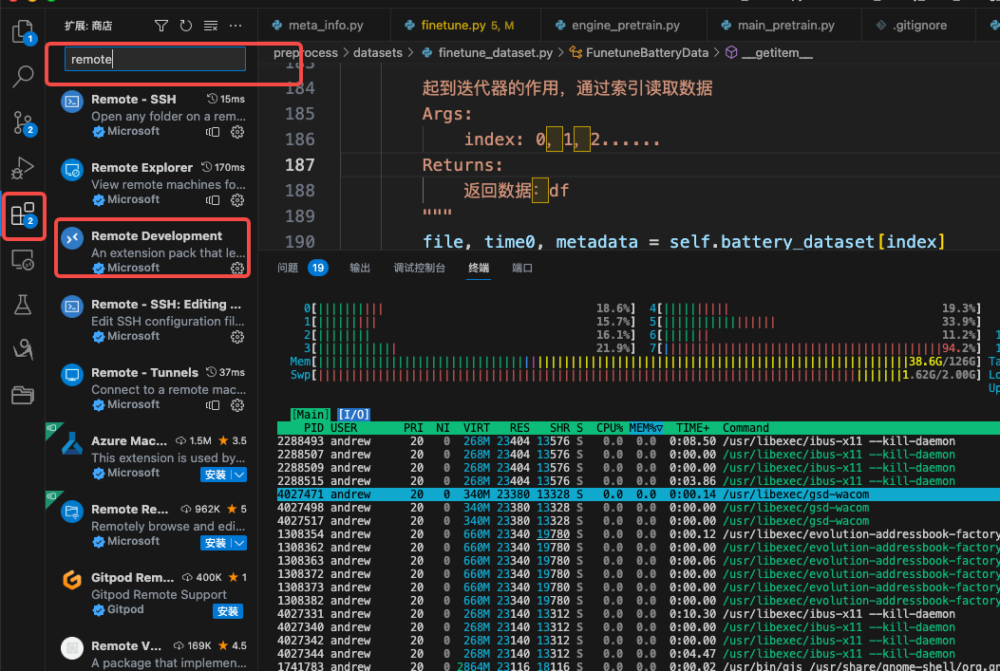
### 3.配置远程服务器
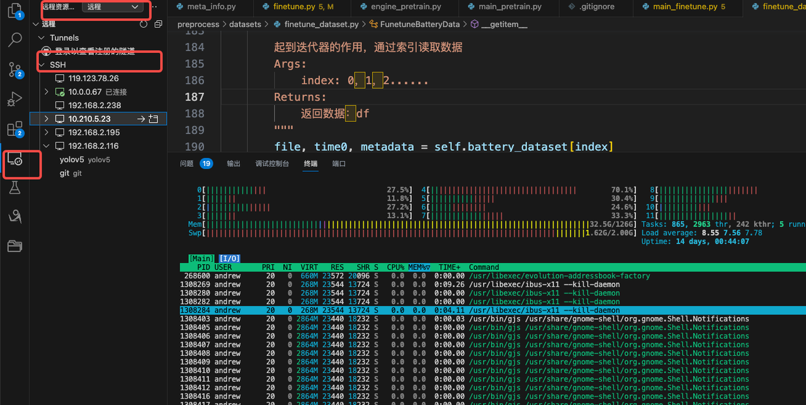
4.添加服务器
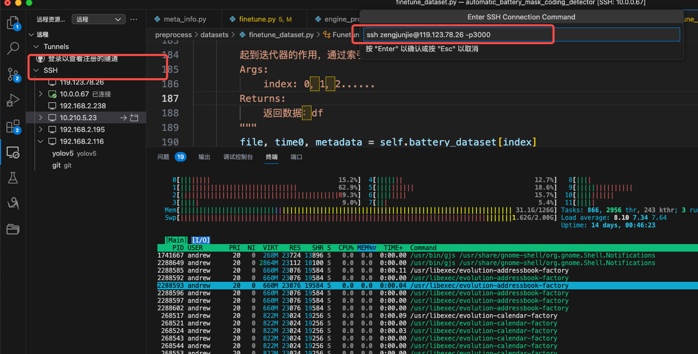

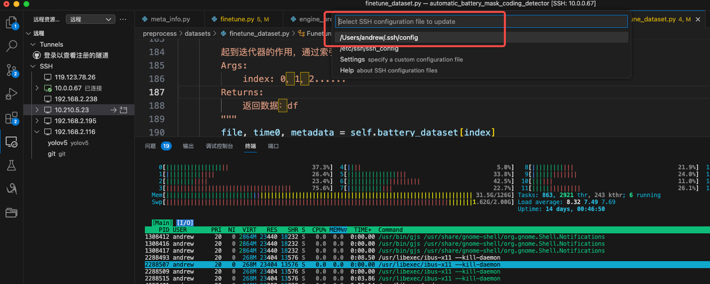

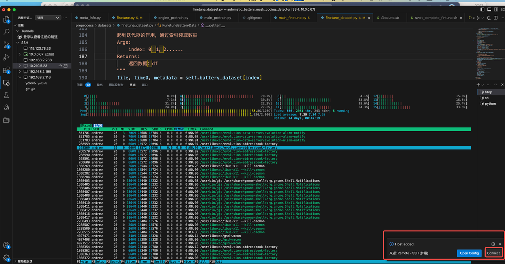
### 5.连接输入密码
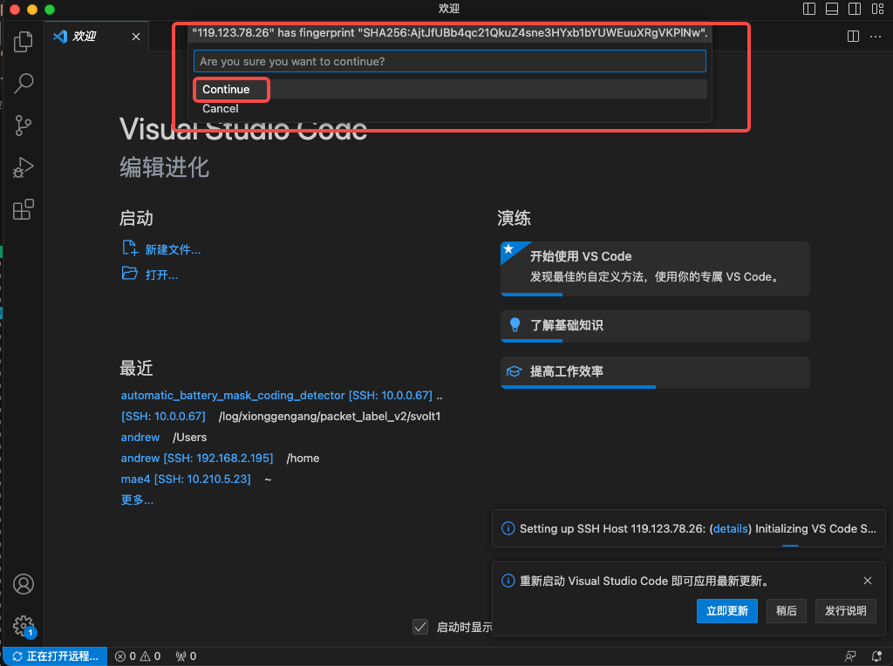

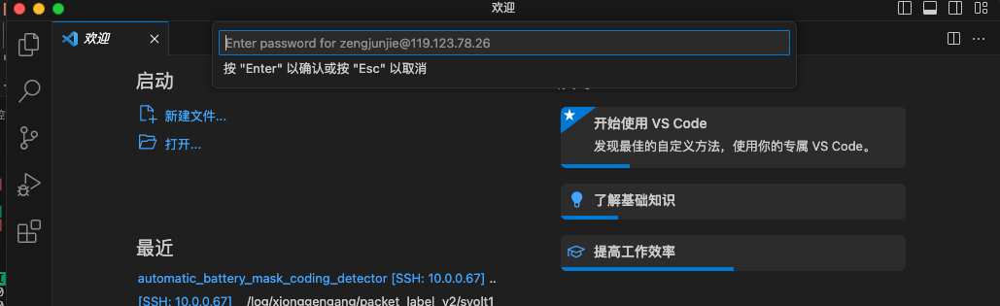
### 6.可选配置免密码登陆
macos/linux 机器
设置ssh key
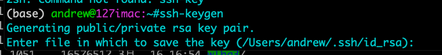
ssh-copy-id上传你的ssh public key到server
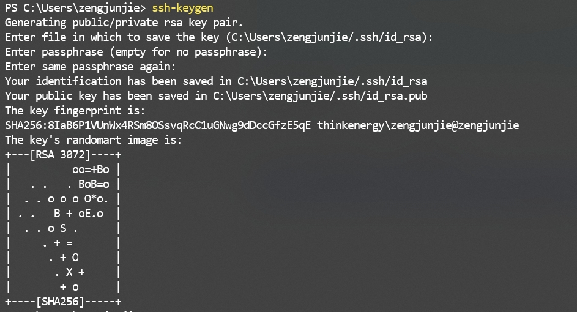
免密设置成功

windows平台
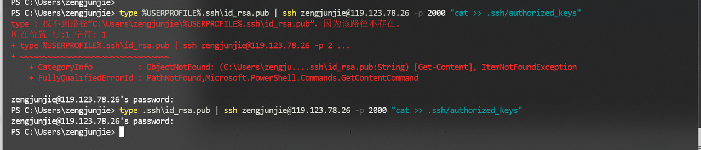
type %USERPROFILE%.ssh\id_rsa.pub | ssh username@server_ip -p port "cat >> .ssh/authorized_keys"

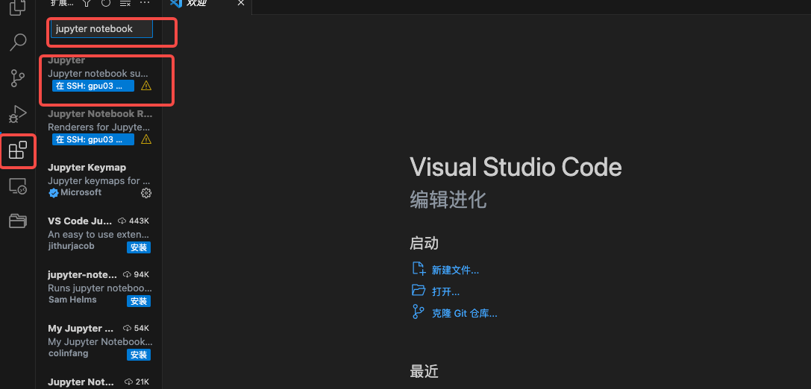
可以删除%USERPROFILE%如果你在windows的家目录下面
输入密码就可以达到和linux的ssh-copy-id一样的功能
7.安装jupyter notebook环境
由于服务器设置没有独立的ip地址，暂时只能用vscode的jupyter notebook，也可以使用端口转发功能映射服务器的8888端口到本地
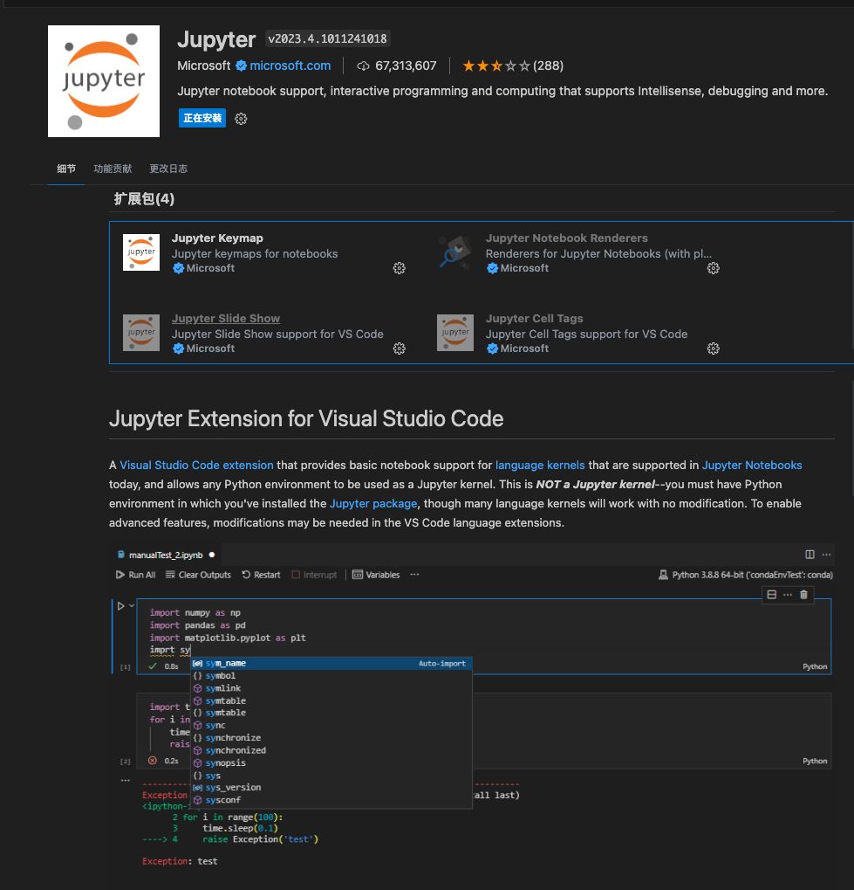
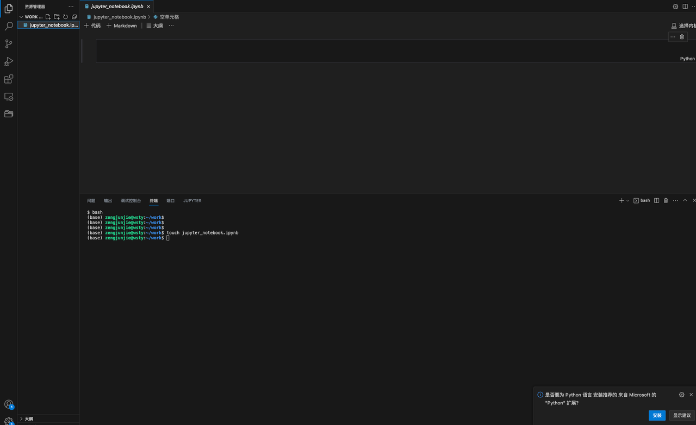
直接打开notebook文件即可
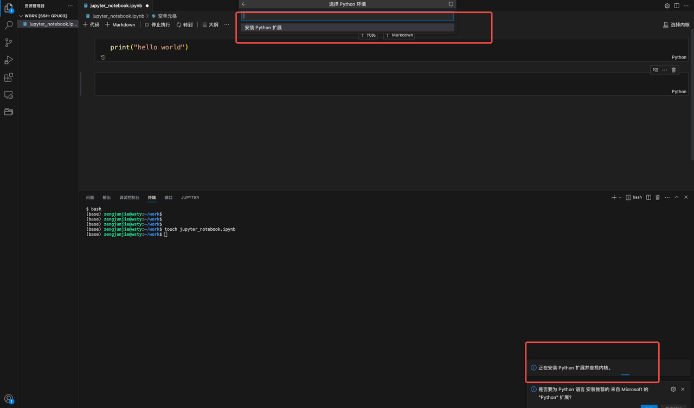
可能需要安装python的插件
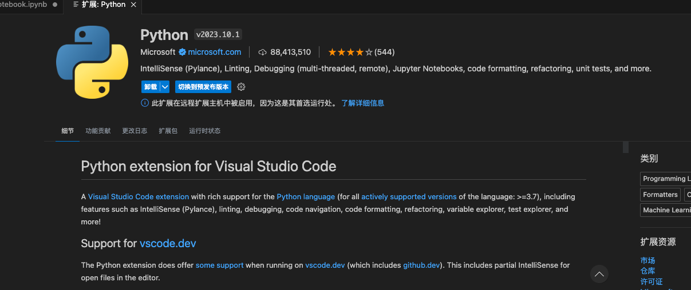
安装即可

选择python环境
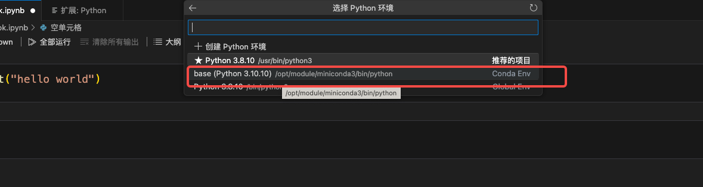
在vscode使用jupyter notebook
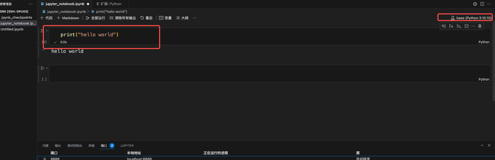