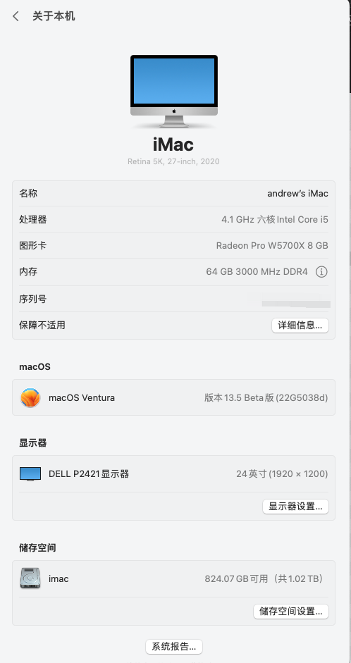

### 配置

intel 10600k  
microstar Z490 unify itx主板   
阿斯加特 32G DDR4   
1TB 阿斯加特 ssd   
500G 西数SN750 ssd  
GPU 5700XT  
机箱 乔思伯V8   
电源 全汉ms600w sfx小电源  

### 成品

```bash
(base) andrew@255imac:~#neofetch
                    'c.          andrew@imac 
                 ,xNMM.          ----------- 
               .OMMMMo           OS: macOS 13.5 22G5038d x86_64 
               OMMM0,            Host: Hackintosh (SMBIOS: iMac20,2) 
     .;loddo:' loolloddol;.      Kernel: 22.6.0 
   cKMMMMMMMMMMNWMMMMMMMMMM0:    Uptime: 8 days, 28 mins 
 .KMMMMMMMMMMMMMMMMMMMMMMMWd.    Packages: 62 (brew) 
 XMMMMMMMMMMMMMMMMMMMMMMMX.      Shell: zsh 5.9 
;MMMMMMMMMMMMMMMMMMMMMMMM:       Resolution: 1920x1200@2x 
:MMMMMMMMMMMMMMMMMMMMMMMM:       DE: Aqua 
.MMMMMMMMMMMMMMMMMMMMMMMMX.      WM: Quartz Compositor 
 kMMMMMMMMMMMMMMMMMMMMMMMMWd.    WM Theme: Blue (Light) 
 .XMMMMMMMMMMMMMMMMMMMMMMMMMMk   Terminal: Apple_Terminal 
  .XMMMMMMMMMMMMMMMMMMMMMMMMK.   Terminal Font: Monaco 
    kMMMMMMMMMMMMMMMMMMMMMMd     CPU: Intel i5-10600K (12) @ 4.10GHz 
     ;KMMMMMMMWXXWMMMMMMMk.      GPU: AMD Radeon RX 460/560 
       .cooc,.    .,coo:.        Memory: 36909MiB / 65536MiB 

                                                         
                                        
```


## 参考EFI
https://github.com/wjz304/Hackintosh-EFI-MSI-Z490i-Unify